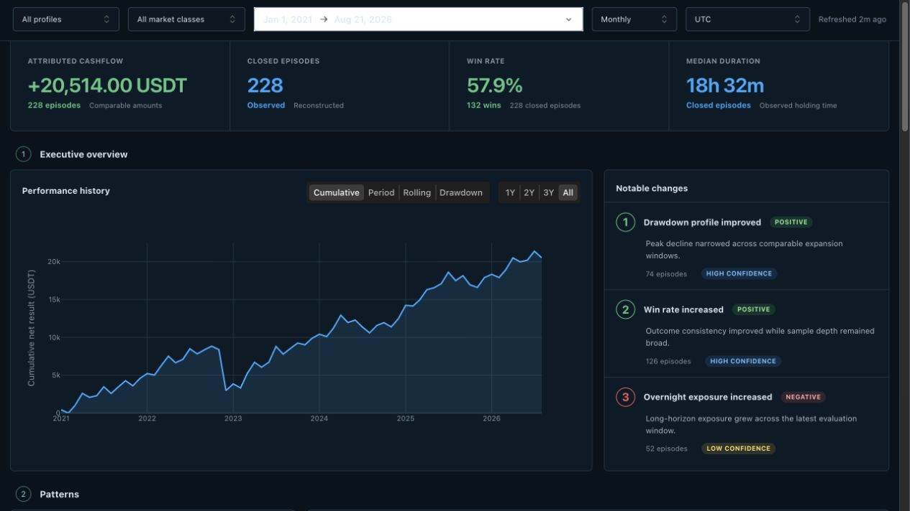
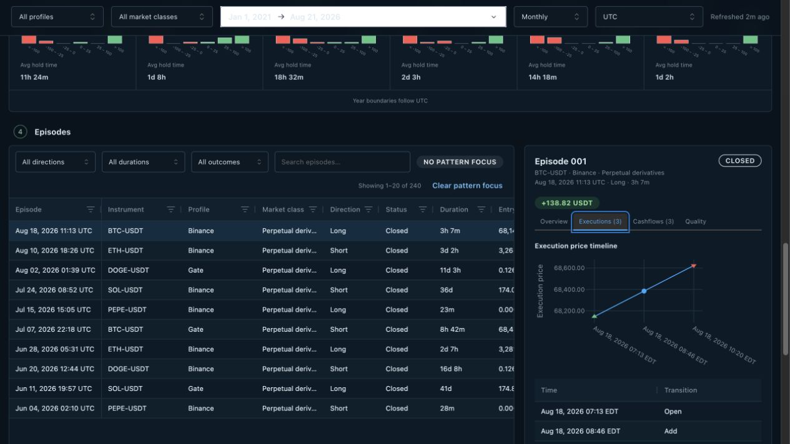

# Perp Trade History

A private, read-only trading dashboard for exploring long-term perpetual-account
history across venues and years.

Perp Trade History gives you:

- A polished, scrollable dashboard for performance, patterns, and trade review
- Filters for period, account profile, market class, direction, duration, and outcome
- Weekday, time-of-day, exposure-duration, and annual comparisons
- Drill-downs from a pattern to the exact episodes, executions, and cashflows
- Automatic dashboard refresh when collected history changes
- Visible source gaps and episode-quality warnings
- Local storage and account credentials that never need trading permissions



_The built-in sample history shows the real dashboard with synthetic data; no account
data is included._

## Quick start

Python 3.11 or newer is required.

1. Download and prepare the application.

   ```bash
   git clone https://github.com/latheiere/perp-trade-history.git
   cd perp-trade-history
   make bootstrap
   ```

2. Open `config/config.toml`, enable the venues you use, and add their read-only
   credentials to `config/credentials.env`.

3. Download available history and open the dashboard.

   ```bash
   make first-run
   ```

The first run may take a while when an account has substantial history. Later runs
update the same local dataset without duplicating records.

Credentials need account and trade-history access only. Do not grant order,
transfer, or withdrawal permissions.

## Everyday use

Open the dashboard from already collected data:

```bash
make dashboard
```

Refresh all history currently available through the configured APIs:

```bash
make history
```

The dashboard notices updated data automatically.

## From pattern to evidence

Select a weekday-hour cell, exposure row, or episode to move from a performance
pattern to its underlying executions and cashflows.



## Learn more

- [Use the dashboard](docs/dashboard.md)
- [Refresh, diagnose, back up, and restore data](docs/operations.md)
- [Extend older history with account archives](docs/binance-archive-backfill.md)
- [Choose and rebuild the reporting currency](docs/conversion.md)
- [Add optional unattended operation](docs/optional-extensions.md)

## Get help

Check configuration and local data access first:

```bash
.venv/bin/perp-trade-history \
  --config config/config.toml \
  --secrets config/credentials.env \
  doctor
```

If the problem remains, [open a GitHub issue](https://github.com/latheiere/perp-trade-history/issues)
with the command you ran, the sanitized error, your Python version, and the affected
adapter. Never include credentials, signed URLs, or account identifiers.

## License

Licensed under the [Apache License 2.0](LICENSE).
